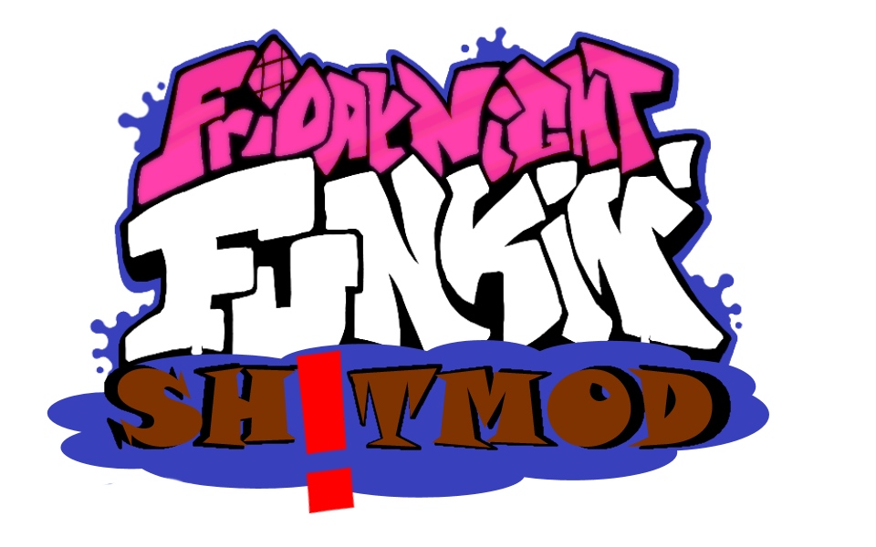

# Friday Night Funkin' - SH!TMOD on Psych Engine
### A LOT OF THE CONTENT THAT USED TO BE HERE I'VE DELETED TO SAVE SPACE

### IF YOU WANNA READ IT GO TO THE [ORIGINAL REPOSITORY](https://github.com/ShadowMario/FNF-PsychEngine) THANKS

# SH!TMOD
This repository will house my own personal changes to Psych Engine for the purpose of housing the funny edits I make for my own mod, SH!TMOD.

SH!TMOD consists of low-effort garbage meme variants of the songs contained in Weeks 1 through 5 (with 6 planned at some point in the future probably).
If you wish to contribute, don't

## Installation:
You must have [the most up-to-date version of Haxe](https://haxe.org/download/), seriously, stop using 4.1.5, it misses some stuff.

Follow a Friday Night Funkin' source code compilation tutorial, after this you will need to install LuaJIT.

To install LuaJIT do this: `haxelib git linc_luajit https://github.com/nebulazorua/linc_luajit` on a Command prompt/PowerShell

...Or if you don't want your mod to be able to run .lua scripts, delete the "LUA_ALLOWED" line on Project.xml

If you get an error about StatePointer when using Lua, run `haxelib remove linc_luajit` into Command Prompt/PowerShell, then re-install linc_luajit.

If you want video support on your mod, simply do `haxelib install hxCodec` on a Command prompt/PowerShell

otherwise, you can delete the "VIDEOS_ALLOWED" Line on Project.xml

## Credits:
* Shadow Mario - Programmer
* RiverOaken - Artist
* Yoshubs - Assistant Programmer

### Special Thanks
* bbpanzu - Ex-Programmer
* shubs - New Input System
* SqirraRNG - Crash Handler and Base code for Chart Editor's Waveform
* KadeDev - Fixed some cool stuff on Chart Editor and other PRs
* iFlicky - Composer of Psync and Tea Time, also made the Dialogue Sounds
* PolybiusProxy - .MP4 Video Loader Library (hxCodec)
* Keoiki - Note Splash Animations
* Smokey - Sprite Atlas Support
* Nebula the Zorua - LUA JIT Fork and some Lua reworks
_____________________________________
